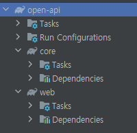
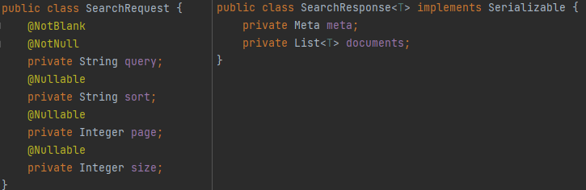

# readme.md

# assignment

## 0. 개발 환경

- JAVA 17
- Spring Boot v2.7.3
- Gradle v7.5

## 1. 프로젝트 구조

- 멀티 모듈 프로젝트

  

- root 모듈(open-api)는 core, web이라는 하위 프로젝트를 관리한다.
- core 모듈은 핵심 도메인에 관련된 내용이고, web은 core에 의존한다.
- web 모듈은 프리젠테이션 레이어에 관련된 모듈이다.


## 2. 애플리케이션 실행 방법

```bash
java -jar open-api.jar
```


## 3. 애플리케이션 구현 과정 및 선택 구현 사항

- 검색 랭킹
  - V1 레디스에 Atomic 자료형을 사용하여 동시성 처리
  - V2 레디스 zset 자료구조를 활용
  
- 컨텐츠 조회 서비스
  - 컨트롤러 입출력 모델
      - kakao developers 개발 가이드를 참고하여 searchRequest, searchResponse를 일반화하여 blog, book, cafe등에도 적용가능하도록 설계

        
      
  - 비즈니스 플로우
    - request history를 DB에 저장
    - 레디스에 검색결과에 따른 count 추가
    - 트래픽이 많고, 저장되어 있는 데이터가 많음을 염두하여, 10초간 최근 검색한 결과내용 레디스에 캐싱
      - key는 `host+"/"+ uri +"?" + queryString`, value는 SearchResponse<T>를 캐싱
      - 10초안에 똑같은 request를 호출한 경우 api호출하지 않음
  
  - 설계시 고려사항
    - facade 계층을 추가하여, 컨트롤러단에서 내부 서비스 플로우를 숨겨서 컨트롤러단을 단순화시킴
    - 추후 카카오 API 이외에 새로운 검색 소스가 추가될 경우를 대비하여 '카카오 검색 서비스'를 인터페이스에 의존하여 구현
  
  - 예외처리
    - GlobalExceptionHandler를 구현하고 CustomException등록
  
  - 테스트
    - SearchControllerTest로 통합테스트 구현

## 4. API 명세 및 테스트 예시

아래의 엔드포인트와 HTTP 메서드, 요청 본문으로 테스트 가능

- api 명세 간단 요약

| Method | Request URI        | Description |
|--------|--------------------|-------------|
| GET    | api/v1/search/{contentsType} | 컨텐츠 조회 V1   |
| GET    | api/v1/search/rank | 검색 랭킹 조회 V1 |
| GET    | api/v2/search/{contentsType} | 컨텐츠 조회 V2   |
| GET    | api/v2/search/rank | 검색 랭킹 조회 V2 |


# 

### **1) 블로그 조회 V1**

레디스에 Atomic 자료형을 사용하여 검색조회 카운트 동시성 처리

# 

```json
GET  localhost:8080/api/v2/search/blog?query=https://brunch.co.kr/@tourism 여행&page=1&size=10&sort=accuracy

----------------------- ↓ response ↓ -----------------------

{
  "statusCode": 200,
  "message": "success",
  "data": {
    "meta": {
      "total_count": 2,
      "pageable_count": 2,
      "is_end": true
    },
    "documents": [
      {
        "blogname": "<개념여행>, <여행을가다, 희망을보다> 저자 정란수",
        "contents": "브런치 연재글은 다음의 링크에서 보실 수 있습니다~ 브런치 내 제 글을 보시려면 다음의 링크를 따라가주세요 ^^ <b>https://brunch.co.kr/@tourism</b> 정란수의 브런치 <b>여행</b>다니면서 일하는 &#34;한량&#34;! &lt;개념<b>여행</b>&gt; 저자이면서, 관광개발 컨설팅을 하고 돌아다님 www.tourism.re.kr , www.facebook.com/projectsoo brunch.co.kr...",
        "datetime": "2016-01-17T23:24:00.000+09:00",
        "thumbnail": "https://search4.kakaocdn.net/argon/130x130_85_c/7dtORyQIlj3",
        "title": "[<b>여행</b>?희망!] _ 브런치 연재글 다음 메인에 선정",
        "url": "https://blog.naver.com/jeongransoo/220600431408"
      },
      {
        "blogname": "<개념여행>, <여행을가다, 희망을보다> 저자 정란수",
        "contents": "이른바 &#34;헬조선&#34;을 극복하기 위해 <b>여행</b>에서 만난 다양한 이야기를 풀어나가려 합니다. 링크는 다음과 같습니다 ^^ <b>https://brunch.co.kr/@tourism</b> 정란수의 브런치 <b>여행</b>다니면서 일하는 &#34;한량&#34;! &lt;개념<b>여행</b>&gt;이라는 책을 펴냈다가 출판사에 미안하게 되어버림. brunch.co.kr 아마도 이 블로그에도 내용을 요약해서 소개할...",
        "datetime": "2015-10-17T16:44:00.000+09:00",
        "thumbnail": "https://search1.kakaocdn.net/argon/130x130_85_c/EvscfrxMzLn",
        "title": "<b>여행</b>을 통해 희망을 발견하기 브런치 연재 시작",
        "url": "https://blog.naver.com/jeongransoo/220511478588"
      }
    ]
  }
}

```

# 

### **2) 검색 랭킹 조회 V1**

QueryDsl을 활용하여 History테이블의 검색어별로 Grouping하고 Ordering하여 결과 리턴 

# 

```json
GET  localhost:8080/api/v1/search/rank?page=0&size=10

----------------------- ↓ response ↓ -----------------------

{
  "statusCode": 200,
  "message": "success",
  "data": {
    "content": [
      {
        "query": "정말 저에게 큰 도움이 되는 과제였습니다.",
        "count": 64
      },
      {
        "query": "더욱 성장하는 계기가 되게 해주셔서 감사합니다.",
        "count": 57
      },
      {
        "query": "공부공",
        "count": 33
      },
      {
        "query": "스타벅",
        "count": 30
      },
      {
        "query": "나는 할수 있",
        "count": 26
      },
      {
        "query": "천재",
        "count": 23
      },
      {
        "query": "치킨",
        "count": 20
      },
      {
        "query": "최선을 다하자",
        "count": 16
      },
      {
        "query": "운동을 꾸준히 하",
        "count": 16
      },
      {
        "query": "축구",
        "count": 14
      }
    ],
    "pageable": {
      "sort": {
        "empty": true,
        "sorted": false,
        "unsorted": true
      },
      "offset": 0,
      "pageNumber": 0,
      "pageSize": 10,
      "unpaged": false,
      "paged": true
    },
    "last": false,
    "totalPages": 2,
    "totalElements": 15,
    "size": 10,
    "number": 0,
    "sort": {
      "empty": true,
      "sorted": false,
      "unsorted": true
    },
    "first": true,
    "numberOfElements": 10,
    "empty": false
  }
}
```

# 

### **3) 블로그 조회 V2**

Redis Sorted Set에 검색어별 카운트 조회수 반영

# 

```json
GET  localhost:8080/api/v2/search/blog?query=https://brunch.co.kr/@tourism 여행&page=1&size=10&sort=accuracy

----------------------- ↓ response ↓ -----------------------

{
  "statusCode": 200,
  "message": "success",
  "data": {
    "meta": {
      "total_count": 2,
      "pageable_count": 2,
      "is_end": true
    },
    "documents": [
      {
        "blogname": "<개념여행>, <여행을가다, 희망을보다> 저자 정란수",
        "contents": "브런치 연재글은 다음의 링크에서 보실 수 있습니다~ 브런치 내 제 글을 보시려면 다음의 링크를 따라가주세요 ^^ <b>https://brunch.co.kr/@tourism</b> 정란수의 브런치 <b>여행</b>다니면서 일하는 &#34;한량&#34;! &lt;개념<b>여행</b>&gt; 저자이면서, 관광개발 컨설팅을 하고 돌아다님 www.tourism.re.kr , www.facebook.com/projectsoo brunch.co.kr...",
        "datetime": "2016-01-17T23:24:00.000+09:00",
        "thumbnail": "https://search4.kakaocdn.net/argon/130x130_85_c/7dtORyQIlj3",
        "title": "[<b>여행</b>?희망!] _ 브런치 연재글 다음 메인에 선정",
        "url": "https://blog.naver.com/jeongransoo/220600431408"
      },
      {
        "blogname": "<개념여행>, <여행을가다, 희망을보다> 저자 정란수",
        "contents": "이른바 &#34;헬조선&#34;을 극복하기 위해 <b>여행</b>에서 만난 다양한 이야기를 풀어나가려 합니다. 링크는 다음과 같습니다 ^^ <b>https://brunch.co.kr/@tourism</b> 정란수의 브런치 <b>여행</b>다니면서 일하는 &#34;한량&#34;! &lt;개념<b>여행</b>&gt;이라는 책을 펴냈다가 출판사에 미안하게 되어버림. brunch.co.kr 아마도 이 블로그에도 내용을 요약해서 소개할...",
        "datetime": "2015-10-17T16:44:00.000+09:00",
        "thumbnail": "https://search1.kakaocdn.net/argon/130x130_85_c/EvscfrxMzLn",
        "title": "<b>여행</b>을 통해 희망을 발견하기 브런치 연재 시작",
        "url": "https://blog.naver.com/jeongransoo/220511478588"
      }
    ]
  }
}

```

# 

### **4) 검색 랭킹 조회 V2**

Redis Sorted Set을 활용하여 검색어 별 랭킹 제공

# 

```json
GET  localhost:8080/api/v2/search/rank
        
----------------------- ↓ response ↓ -----------------------
{
  "statusCode": 200,
  "message": "success",
  "data": [
    {
      "query": "정말 저에게 큰 도움이 되는 과제였습니다.",
      "count": 64
    },
    {
      "query": "더욱 성장하는 계기가 되게 해주셔서 감사합니다.",
      "count": 57
    },
    {
      "query": "공부공",
      "count": 33
    },
    {
      "query": "스타벅",
      "count": 30
    },
    {
      "query": "나는 할수 있",
      "count": 26
    },
    {
      "query": "천재",
      "count": 23
    },
    {
      "query": "치킨",
      "count": 20
    },
    {
      "query": "최선을 다하자",
      "count": 16
    },
    {
      "query": "운동을 꾸준히 하",
      "count": 16
    },
    {
      "query": "노력하",
      "count": 2
    }
  ]
}
```

## TODO

- 블로그 조회 V1
- 검색 랭킹 조회 V1
- 블로그 조회 V2
- 검색 랭킹 조회 V2
