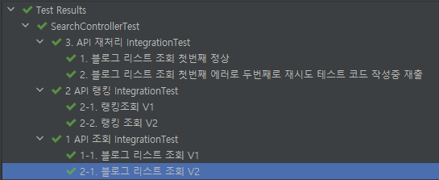

# readme.md

# assignment

## 0. 개발 환경

- JAVA 17
- Spring Boot v2.7.3
- Gradle v7.5

## 1. 프로젝트 구조

- 멀티 모듈 프로젝트

  

- root 모듈(open-api)는 core, web이라는 하위 프로젝트를 관리한다.
- core 모듈은 핵심 도메인에 관련된 내용이고, web은 core에 의존한다.
- web 모듈은 프리젠테이션 레이어에 관련된 모듈이다.


## 2. 애플리케이션 실행 방법

```bash
java -jar web-0.0.3-SNAPSHOT.jar
```
- 주의사항
    - api에서 sort컬럼은 validation 체크를 하기 때문에 올바른값 넣어줘야한다.
        - exceptionhandler 시간상 못해서, Bad Request로만 날아온다.
        - 카카오 sort Pattern(regexp = "accuracy|recency")
        - 네이버 sort Pattern(regexp = "sim|date")

## 3. 애플리케이션 구현 과정 및 선택 구현 사항

- 검색 랭킹
    - V1 History DB에 저장된 로그를 기반으로 검색어별 카운트를 조회(querydsl)
        - V1 조회 서비스를 사용하는 경우는 ZSET을 업데이트하지않아 V2랭킹서비스에 집계가 안될 수 있음
    - V2 레디스 zset 자료구조를 활용하여 검색어 랭킹 조회(1~10등)

- 컨텐츠 조회 서비스
    - 컨트롤러 입출력 모델
        - kakao developers 개발 가이드를 참고하여 searchRequest, searchResponse를 일반화하여 blog, book, cafe등에도 적용가능하도록 설계

          

    - 비즈니스 플로우
        1. request history를 DB에 저장
            - 트래픽을 고려하여 DB 저장하는 로직을 CompletableFuture를 적용하여 Async하게 처리하여 성능향상을 꾀함
        2. 레디스에 같은 같은 내용으로 검색한 내용이 있는지 먼저 조회후, 없으면 API를 호출
            - 트래픽이 많고, 저장되어 있는 데이터가 많음을 염두하여, 10초간 최근 검색한 결과내용 레디스에 캐싱
            - key는 `host+"/"+ uri +"?" + queryString`, value는 SearchResponse<T>를 캐싱
            - 10초안에 똑같은 request를 호출한 경우 api호출하지 않고 캐시에 저장된 내용을 전달
        3. 레디스에 검색어와 검색요청회수 update
            - V1 : redis에 Atomic 자료형을 사용하여 검색어에 따른 검색 횟수 업데이트
            - V2 : Sorted Set을 활용

    - 카카오 블로그 검색 API에 장애가 발생한 경우, 네이버 블로그 검색 API를 통해 데이터 제공
        - onErrorResume을 통하여 구현

    - 설계시 고려사항
        - facade 계층을 추가하여, 컨트롤러단에서 내부 서비스 플로우를 숨겨서 컨트롤러단을 단순화시킴
        - 추후 카카오 API 이외에 새로운 검색 소스가 추가될 경우를 대비하여 '카카오 검색 서비스'를 인터페이스에 의존하여 구현

        - 예외처리
            - GlobalExceptionHandler를 구현하고 CustomException등록

        - 테스트
            - SearchControllerTest로 통합테스트 구현
                - 

## 4. API 명세 및 테스트 예시

아래의 엔드포인트와 HTTP 메서드, 요청 본문으로 테스트 가능

- api 명세 간단 요약

| Method | Request URI        | Description |
|--------|--------------------|-------------|
| GET    | api/v1/search/{contentsType} | 컨텐츠 조회 V1   |
| GET    | api/v1/search/rank | 검색 랭킹 조회 V1 |
| GET    | api/v2/search/{contentsType} | 컨텐츠 조회 V2   |
| GET    | api/v2/search/rank | 검색 랭킹 조회 V2 |
| GET    | `api2`/v2/search/blog.json | 네이버 API 연동(내부 테스트용) |
| GET    | api/v3/search/blog | 카카오 api에서 실패시 네이버 api 사용 |

# 

### **1) 블로그 조회 V1**

레디스에 Atomic 자료형을 사용하여 검색조회 카운트 동시성 처리

# 

```json
GET  localhost:8080/api/v2/search/blog?query=https://brunch.co.kr/@tourism 여행&page=1&size=10&sort=accuracy

----------------------- ↓ response ↓ -----------------------

{
  "statusCode": 200,
  "message": "success",
  "data": {
    "meta": {
      "total_count": 2,
      "pageable_count": 2,
      "is_end": true
    },
    "documents": [
      {
        "blogname": "<개념여행>, <여행을가다, 희망을보다> 저자 정란수",
        "contents": "브런치 연재글은 다음의 링크에서 보실 수 있습니다~ 브런치 내 제 글을 보시려면 다음의 링크를 따라가주세요 ^^ <b>https://brunch.co.kr/@tourism</b> 정란수의 브런치 <b>여행</b>다니면서 일하는 &#34;한량&#34;! &lt;개념<b>여행</b>&gt; 저자이면서, 관광개발 컨설팅을 하고 돌아다님 www.tourism.re.kr , www.facebook.com/projectsoo brunch.co.kr...",
        "datetime": "2016-01-17T23:24:00.000+09:00",
        "thumbnail": "https://search4.kakaocdn.net/argon/130x130_85_c/7dtORyQIlj3",
        "title": "[<b>여행</b>?희망!] _ 브런치 연재글 다음 메인에 선정",
        "url": "https://blog.naver.com/jeongransoo/220600431408"
      },
      {
        "blogname": "<개념여행>, <여행을가다, 희망을보다> 저자 정란수",
        "contents": "이른바 &#34;헬조선&#34;을 극복하기 위해 <b>여행</b>에서 만난 다양한 이야기를 풀어나가려 합니다. 링크는 다음과 같습니다 ^^ <b>https://brunch.co.kr/@tourism</b> 정란수의 브런치 <b>여행</b>다니면서 일하는 &#34;한량&#34;! &lt;개념<b>여행</b>&gt;이라는 책을 펴냈다가 출판사에 미안하게 되어버림. brunch.co.kr 아마도 이 블로그에도 내용을 요약해서 소개할...",
        "datetime": "2015-10-17T16:44:00.000+09:00",
        "thumbnail": "https://search1.kakaocdn.net/argon/130x130_85_c/EvscfrxMzLn",
        "title": "<b>여행</b>을 통해 희망을 발견하기 브런치 연재 시작",
        "url": "https://blog.naver.com/jeongransoo/220511478588"
      }
    ]
  }
}

```

# 

### **2) 검색 랭킹 조회 V1**

QueryDsl을 활용하여 History테이블의 검색어별로 Grouping하고 Ordering하여 결과 리턴

# 

```json
GET  localhost:8080/api/v1/search/rank?page=0&size=10

----------------------- ↓ response ↓ -----------------------

{
  "statusCode": 200,
  "message": "success",
  "data": {
    "content": [
      {
        "query": "정말 저에게 큰 도움이 되는 과제였습니다.",
        "count": 64
      },
      {
        "query": "더욱 성장하는 계기가 되게 해주셔서 감사합니다.",
        "count": 57
      },
      {
        "query": "공부공",
        "count": 33
      },
      {
        "query": "스타벅",
        "count": 30
      },
      {
        "query": "나는 할수 있",
        "count": 26
      },
      {
        "query": "천재",
        "count": 23
      },
      {
        "query": "치킨",
        "count": 20
      },
      {
        "query": "최선을 다하자",
        "count": 16
      },
      {
        "query": "운동을 꾸준히 하",
        "count": 16
      },
      {
        "query": "축구",
        "count": 14
      }
    ],
    "pageable": {
      "sort": {
        "empty": true,
        "sorted": false,
        "unsorted": true
      },
      "offset": 0,
      "pageNumber": 0,
      "pageSize": 10,
      "unpaged": false,
      "paged": true
    },
    "last": false,
    "totalPages": 2,
    "totalElements": 15,
    "size": 10,
    "number": 0,
    "sort": {
      "empty": true,
      "sorted": false,
      "unsorted": true
    },
    "first": true,
    "numberOfElements": 10,
    "empty": false
  }
}
```

# 

### **3) 블로그 조회 V2**

Redis Sorted Set에 검색어별 카운트 조회수 반영

# 

```json
GET  localhost:8080/api/v2/search/blog?query=https://brunch.co.kr/@tourism 여행&page=1&size=10&sort=accuracy

----------------------- ↓ response ↓ -----------------------

{
  "statusCode": 200,
  "message": "success",
  "data": {
    "meta": {
      "total_count": 2,
      "pageable_count": 2,
      "is_end": true
    },
    "documents": [
      {
        "blogname": "<개념여행>, <여행을가다, 희망을보다> 저자 정란수",
        "contents": "브런치 연재글은 다음의 링크에서 보실 수 있습니다~ 브런치 내 제 글을 보시려면 다음의 링크를 따라가주세요 ^^ <b>https://brunch.co.kr/@tourism</b> 정란수의 브런치 <b>여행</b>다니면서 일하는 &#34;한량&#34;! &lt;개념<b>여행</b>&gt; 저자이면서, 관광개발 컨설팅을 하고 돌아다님 www.tourism.re.kr , www.facebook.com/projectsoo brunch.co.kr...",
        "datetime": "2016-01-17T23:24:00.000+09:00",
        "thumbnail": "https://search4.kakaocdn.net/argon/130x130_85_c/7dtORyQIlj3",
        "title": "[<b>여행</b>?희망!] _ 브런치 연재글 다음 메인에 선정",
        "url": "https://blog.naver.com/jeongransoo/220600431408"
      },
      {
        "blogname": "<개념여행>, <여행을가다, 희망을보다> 저자 정란수",
        "contents": "이른바 &#34;헬조선&#34;을 극복하기 위해 <b>여행</b>에서 만난 다양한 이야기를 풀어나가려 합니다. 링크는 다음과 같습니다 ^^ <b>https://brunch.co.kr/@tourism</b> 정란수의 브런치 <b>여행</b>다니면서 일하는 &#34;한량&#34;! &lt;개념<b>여행</b>&gt;이라는 책을 펴냈다가 출판사에 미안하게 되어버림. brunch.co.kr 아마도 이 블로그에도 내용을 요약해서 소개할...",
        "datetime": "2015-10-17T16:44:00.000+09:00",
        "thumbnail": "https://search1.kakaocdn.net/argon/130x130_85_c/EvscfrxMzLn",
        "title": "<b>여행</b>을 통해 희망을 발견하기 브런치 연재 시작",
        "url": "https://blog.naver.com/jeongransoo/220511478588"
      }
    ]
  }
}

```

# 

### **4) 검색 랭킹 조회 V2**

Redis Sorted Set을 활용하여 검색어 별 랭킹 제공

# 

```json
GET  localhost:8080/api/v2/search/rank
        
----------------------- ↓ response ↓ -----------------------
{
  "statusCode": 200,
  "message": "success",
  "data": [
    {
      "query": "정말 저에게 큰 도움이 되는 과제였습니다.",
      "count": 64
    },
    {
      "query": "더욱 성장하는 계기가 되게 해주셔서 감사합니다.",
      "count": 57
    },
    {
      "query": "공부공",
      "count": 33
    },
    {
      "query": "스타벅",
      "count": 30
    },
    {
      "query": "나는 할수 있",
      "count": 26
    },
    {
      "query": "천재",
      "count": 23
    },
    {
      "query": "치킨",
      "count": 20
    },
    {
      "query": "최선을 다하자",
      "count": 16
    },
    {
      "query": "운동을 꾸준히 하",
      "count": 16
    },
    {
      "query": "노력하",
      "count": 2
    }
  ]
}
```

### **5) 테스트용 네이버 API 조회**

네이버 API 확인 테스트를 위해 구현

# 

```json
GET  localhost:8080/api2/v2/search/blog.json?query=여행&display=10&start=1&sort=sim
        
----------------------- ↓ response ↓ -----------------------
{
"statusCode": 200,
"message": "success",
"data": {
"lastBuildDate": "Wed, 21 Sep 2022 21:25:12 +0900",
"total": 46230809,
"start": 1,
"display": 10,
"items": [
{
"title": "거제도<b>여행</b> 호텔리베라 거제 오션뷰 후기",
"link": "https://blog.naver.com/katie85?Redirect=Log&logNo=222872630561",
"description": "거제도<b>여행</b> 호텔리베라 거제 오션뷰 후기 안녕하세요~ 2박3일 거제도 <b>여행</b>후기 이어서 올려봅니다.. 호텔리뷰 써보려고요~ 늦은 여름휴가로 거제도를 다녀왔는데 마침 해수욕장이 폐장된 몇일 후에 가서..... ",
"bloggername": "오늘도 여행",
"bloggerlink": "https://blog.naver.com/katie85",
"postdate": "20220916"
},
{
"title": "태국 골프<b>여행</b> 방콕 알파인CC 골프장 후기",
"link": "https://blog.naver.com/duohaigolf?Redirect=Log&logNo=222856793946",
"description": "시기적으로 9월이나 10월까지는 해외로 골프<b>여행</b> 가기가 애매한 기간이기도하지만 수년째 해외로 나가지못했으니 많은 분들이 가을에도 태국골프<b>여행</b> 등 일정을 생각하시는것 같습니다. 올해부터는 방콕... ",
"bloggername": "世界中的多海",
"bloggerlink": "https://blog.naver.com/duohaigolf",
"postdate": "20220824"
},
{
"title": "포천 산정호수 야경 <b>여행</b> 놀거리",
"link": "https://blog.naver.com/rdal89?Redirect=Log&logNo=222878528807",
"description": "포천 산정호수는 과거에도 한차례 <b>여행</b>을 온 적이 있습니다. 다만, 그때는 다른 포천 놀거리도 함께... 웬만하면 낮, 하다못해 일몰쯤에는 <b>여행</b>을 마무리할 수 있게끔 일정을 조율하는 걸 권장합니다. 밤이 되면... ",
"bloggername": "찌미의 여행을 그리다",
"bloggerlink": "https://blog.naver.com/rdal89",
"postdate": "20220921"
},
{
"title": "동남아 <b>여행</b>지 필리핀 세부 가족<b>여행</b> 추천",
"link": "https://blog.naver.com/nailstan?Redirect=Log&logNo=222875731658",
"description": "동남아 <b>여행</b>지 필리핀 세부 가족<b>여행</b> 추천 동남아 <b>여행</b>지로 아름다운 바다를 자랑하는 필리핀 세부를 추천하고 싶다. 이국적인 해산물 요리와 함께 물놀이를 즐길 수 있어 기억에 남는 세부 가족<b>여행</b>이 되었다.... ",
"bloggername": "행복물결 넘실대는 여행이야기",
"bloggerlink": "https://blog.naver.com/nailstan",
"postdate": "20220915"
},
{
"title": "동남아 <b>여행</b> 태국 치앙마이 <b>여행</b> 와로롯시장 구경",
"link": "https://blog.naver.com/wlsgml850?Redirect=Log&logNo=222853975732",
"description": "지난번 다녀왔던 동남아 <b>여행</b>지 태국 치앙마이 <b>여행</b>에서 마지막 날에는 시간이 남아 전통시장 구경을 했어요. 나라마다 그 지역의 특색을 품고 있는 시장 구경을 하는 걸 좋아하는 편이라 신나기도 했고... ",
"bloggername": "트래블러버의 맛있는 여행",
"bloggerlink": "https://blog.naver.com/wlsgml850",
"postdate": "20220905"
},
{
"title": "나트랑 마사지 럭셔리했던 <b>여행</b> 일정",
"link": "https://blog.naver.com/le7062?Redirect=Log&logNo=222875576078",
"description": "안녕하세요 최근 다녀왔던 나트랑 <b>여행</b> 일정이 너무 만족스러워서 포스팅 해보려고 합니다! 베트남같은 경우 한국사람들이 부담없이 다녀오기로 유명해서 저도 <b>여행</b>지로 선택하게 됐는데 우선 <b>여행</b>을 하면서... ",
"bloggername": "룐의 잡다구리",
"bloggerlink": "https://blog.naver.com/le7062",
"postdate": "20220915"
},
{
"title": "하노이 <b>여행</b> 전망좋은 서머셋 호아빈 하노이 호텔",
"link": "https://blog.naver.com/nau2001?Redirect=Log&logNo=222874776359",
"description": "하노이 <b>여행</b> 전망좋은 서머셋 호아빈 하노이 호텔 글,사진 안녕하세요 트래블홀릭 와그잡입니다. 이번에 베트남 하노이<b>여행</b>을 4박6일 일정으로 다녀왔는데요. 하노이는 지금껏 제가 알던 베트남과는 전혀 다른... ",
"bloggername": "와그잡의 트래블홀릭",
"bloggerlink": "https://blog.naver.com/nau2001",
"postdate": "20220914"
},
{
"title": "베트남 하노이 <b>여행</b> 손오공클라스 ~",
"link": "https://blog.naver.com/dngudwn?Redirect=Log&logNo=222868597920",
"description": "이번에 가족과 함께 다녀온 하노이<b>여행</b>. 하노이는 처음가보는 곳이기도 하고 게다가 해외<b>여행</b>은 정말 오랜만에 가는 길이기도 해서 처음부터 계획을 확실하게 세우고 출발하기로 했어요. 이번엔 부모님, 그리고... ",
"bloggername": "기억하기위한 기록",
"bloggerlink": "https://blog.naver.com/dngudwn",
"postdate": "20220906"
},
{
"title": "유럽 세미패키지 자유<b>여행</b> 즐기는 방법!",
"link": "https://blog.naver.com/sue1753?Redirect=Log&logNo=222874660754",
"description": "지난 추석 연휴 관련 뉴스만 봐도 외국으로 <b>여행</b>을 가는 사람들이 많았는데요. 저도 한달 전에 유럽을 다녀왔었는데 몇 년 만에 간 해외 <b>여행</b>인지라 아직도 꿈만 같네요. 오늘은 유럽 세미패키지로 갈지... ",
"bloggername": "디제니월드:)",
"bloggerlink": "https://blog.naver.com/sue1753",
"postdate": "20220914"
},
{
"title": "싱가포르 자유<b>여행</b> 나 홀로 싱가폴 <b>여행</b> 코스",
"link": "https://blog.naver.com/kyena200?Redirect=Log&logNo=222871397194",
"description": "싱가포르 자유<b>여행</b> 나홀로 싱가포르 <b>여행</b> 코스 글, 사진 쏠트몬 일본은 혼자 자주 <b>여행</b>했지만 그 외에 나라나 도시들은 친구나 지인들과 함께 가곤 했었는데요. 마지막으로 다녀왔던 싱가포르 자유<b>여행</b> 혼자... ",
"bloggername": "soltmon salon",
"bloggerlink": "https://blog.naver.com/kyena200",
"postdate": "20220915"
}
]
}
}
```

### **5) 카카오 검색 API에 장애가 발생한 경우, 네이버 블로그 검색 API를 통해 데이터를 제공A**

카카오 블로그 검색 API가 정상인 경우 카카오 검색 API결과를 주고
카카오 검색 API가 장애인 경우 네이버 request와 매핑하여, 네이버 검색 결과를 준다.

# 

```json
GET  localhost:8080/api/v3/search/blog?query=여행&page=1&size=10&sort=accuracy
        
카카오로 검색했지만 네이버 결과를 주는 모습        
----------------------- ↓ response ↓ -----------------------
{
"statusCode": 200,
"message": "success",
"data": {
"lastBuildDate": "Wed, 21 Sep 2022 21:29:00 +0900",
"total": 46230982,
"start": 11,
"display": 10,
"items": [
{
"title": "베트남 다낭 <b>여행</b> 가볼만한곳 렌트카 바나힐 쿠킹클래스",
"link": "https://blog.naver.com/fromrei8?Redirect=Log&logNo=222879268929",
"description": "베트남 <b>여행</b> 다낭 가볼만한곳 이번 베트남 다낭 <b>여행</b>을 떠나기 전부터 빡센 코스로 안 다니겠다고 몇 번이나 부르짖었다? 그러기 위해서는 사전 준비와 정보가 필요했고, 다낭 렌트카는 필수였다. 그리하여... ",
"bloggername": "프롬레이의 여행잡화점",
"bloggerlink": "https://blog.naver.com/fromrei8",
"postdate": "20220920"
},
{
"title": "제주도 기사포함 렌트카 <b>여행</b> 제주 택시투어가 짱이네요!",
"link": "https://blog.naver.com/ydl1?Redirect=Log&logNo=222877235682",
"description": "얼마 전 향이 제주도 <b>여행</b>가며 블로그 보고 좋은 곳 많아 다 가고 싶은데 1박 2일 다녀와야 하니 꼭 가볼만한곳을 추천해 달라고 카톡이 왔어요. <b>여행</b> 다녀와서 못 올린 곳도 많은데 인터넷 잘 안 하는 지인들도... ",
"bloggername": "타임머신 타고 과거로 딱따구리의 발자취를 찾아서",
"bloggerlink": "https://blog.naver.com/ydl1",
"postdate": "20220917"
},
{
"title": "속초 <b>여행</b> 코스 바다 핫플 관광지 강원도 <b>여행</b>지",
"link": "https://blog.naver.com/tcacyc?Redirect=Log&logNo=222878172510",
"description": "속초 <b>여행</b> 코스 핫플 관광지 강원도 <b>여행</b>지 가을인가 싶었더니 웬걸 늦더위 시샘에 다시 여름이 찾아온 것 같습니다. 그래서인지 아직은 단풍 소식은 전혀 들려오지 않아 이번 강원도 <b>여행</b>으로 지인들과 속초... ",
"bloggername": "일상탈출",
"bloggerlink": "https://blog.naver.com/tcacyc",
"postdate": "20220919"
},
{
"title": "베트남 푸꾸옥 <b>여행</b> 딘커우사원 포함 구경했던 곳",
"link": "https://blog.naver.com/smnsmnsmn?Redirect=Log&logNo=222869458525",
"description": "베트남 푸꾸옥 <b>여행</b> 딘커우사원 포함 구경했던 곳 안녕하세요 싸와디쌤입니다  오랜만에 다녀온 푸꾸옥 <b>여행</b> 포스팅을 해보려고 해요. 푸꾸옥은 어언 10년 전쯤? 푸꾸옥이라는 지명이 저엉말 생소했을 때 친구가... ",
"bloggername": "▶ 언제, 어디서든, 행복하기",
"bloggerlink": "https://blog.naver.com/smnsmnsmn",
"postdate": "20220907"
},
{
"title": "숙취해소제 삽간흥, 이번 <b>여행</b> 필수템이었어요!",
"link": "https://blog.naver.com/dmlgml76?Redirect=Log&logNo=222880023764",
"description": "어릴적 친구들이랑 20여년 만에 <b>여행</b>을 가게 됐어요. 생각해보니 20대에 이 친구들과 간 <b>여행</b>이... 두어번? 그 좋은 시절에 <b>여행</b>안다니고 뭐했을까요 ㅡㅡ;; 이런 저런 이유로 부산에 가기로 했습니다. 한 친구가... ",
"bloggername": "1% 다르게...",
"bloggerlink": "https://blog.naver.com/dmlgml76",
"postdate": "20220920"
},
{
"title": "베트남 다낭 자유<b>여행</b> 요즘 핫플 BEST 5",
"link": "https://blog.naver.com/lovemw3?Redirect=Log&logNo=222861742430",
"description": "베트남 다낭 자유<b>여행</b> 다녀온 미오에요. 현지에서 인기 많다는 핫플레이스도 다녀왔는데 제일 좋았던 다섯 곳을 소개해볼까 합니다 &gt;_&lt; 미케비치 베트남 다낭은 7월과 8월이 가장 건기에요. <b>여행</b>하기 좋은... ",
"bloggername": "미오의 즐거운 인생 ♥",
"bloggerlink": "https://blog.naver.com/lovemw3",
"postdate": "20220830"
},
{
"title": "태백<b>여행</b> :: 태백카페 백번의봄",
"link": "https://blog.naver.com/skyline622?Redirect=Log&logNo=222879394356",
"description": "태백<b>여행</b> 태백카페 백번의봄 태백카페인 백번의봄은 <b>여행</b>을 가기 전부터 친구와 내가 기도했던 장소 중 하나였다. 해외 어딘가로 떠난 것만 같은 이국적인 외관과 아기자기한 내부, 그리고 백번의봄 특유의... ",
"bloggername": "Memoria, 여행더하기",
"bloggerlink": "https://blog.naver.com/skyline622",
"postdate": "20220920"
},
{
"title": "꼭 가봐야할 10월 제주<b>여행</b> 명소 BEST 6",
"link": "https://blog.naver.com/sooji504?Redirect=Log&logNo=222874885181",
"description": "날이 선선해지면서 가을맞이 제주도 <b>여행</b>을 준비하는 분들이 많은 요즘이에요. 저 역시 작년 이맘때쯤에 제주도에 다녀왔는데요. 개인적인 취향을 반영해 꼭 가봐야할 10월 제주<b>여행</b> 명소를 소개해드릴까... ",
"bloggername": "사랑의 놀이터♡",
"bloggerlink": "https://blog.naver.com/sooji504",
"postdate": "20220914"
},
{
"title": "속초 <b>여행</b> 맛집 속초 칼국수 현대장칼국수",
"link": "https://blog.naver.com/duvmfh0327?Redirect=Log&logNo=222870357958",
"description": "놀다보니 배가고파 속초에서 신혼을 즐기는 지인이 추천해준 속초<b>여행</b>맛집인 현대장칼국수 집을... 게다가 속초 <b>여행</b> 맛집은 영업시간도 브레이크타임없이 오전9시30분부터 오후7시30분까지니 여유롭더라구요.... ",
"bloggername": "깡다맘",
"bloggerlink": "https://blog.naver.com/duvmfh0327",
"postdate": "20220909"
},
{
"title": "첫 해외<b>여행</b>:: 비행기타는 법 A to Z",
"link": "https://blog.naver.com/yosinsojin?Redirect=Log&logNo=222880330575",
"description": "미국 <b>여행</b>이 처음인 우리 엄마를 위한 포스팅 :: 공항 체크인의 모든 것 + 장거리 비행 시 챙겨서 좋은 물건들 첫 해외<b>여행</b>을 가시는 분들, 공항에서 비행기 타는 법이 종종 어려울 때가 있는데요. 저도 첫... ",
"bloggername": "jinny의 인생대모험",
"bloggerlink": "https://blog.naver.com/yosinsojin",
"postdate": "20220921"
}
],
"meta": null,
"documents": null
}
}
```


## TODO

- 조회 API
    - 실패하는 경우 네이버 API 연동하도록 설정
        - Resilience4J, CircuitBreaker를 이용한 재처리 적용
    - 현업에서 사용하는 캐싱 알고리즘 조사 후 적용
        - 현재는 query parameter를 기준으로 캐싱하지만, 너무 메모리를 비효율적으로 사용하게 된다.
- 아키텍처
    - web과 api를 모듈을 분리하고 ApiService가 SearchResponse에 의존하는 부분 수정
- 도메인
    - SearchRank 엔티티 추가
- 코드품질
    - 급하게 네이버 API를 추가하다보니 지저분한 부분이 많음
- 레디스
    - 레디스가 뜰때 DB 정보를 바탕으로 query count 세팅
    - redis write-bebind 동작을 활용하여 DB에 동기화
- 테스트
    - 서비스, 리포지토리단 작성
    - 예외처리 테스트 코드 작성